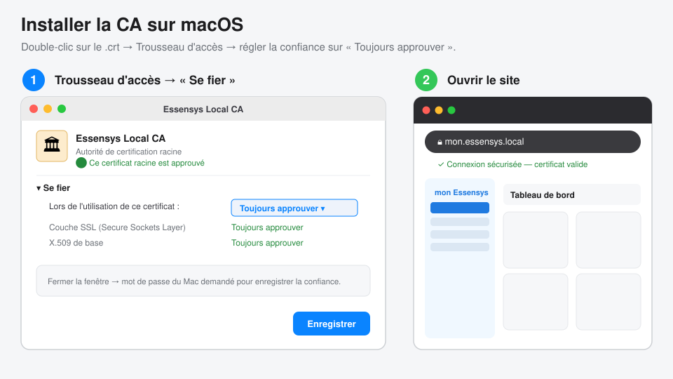
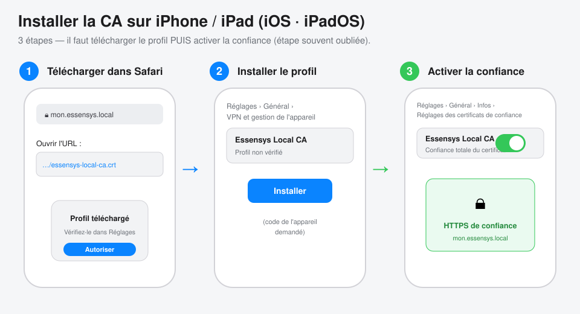
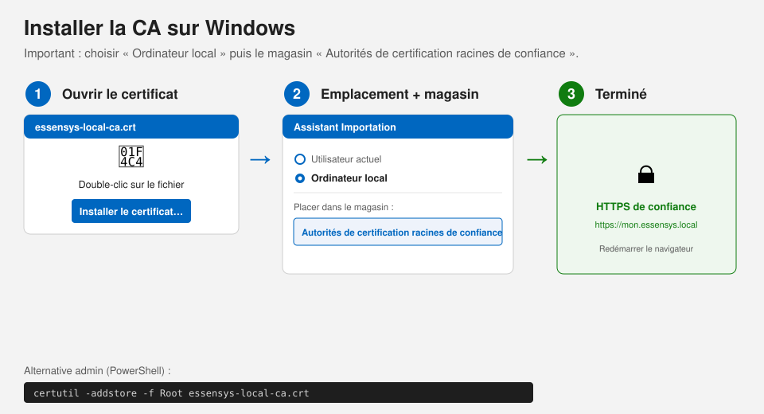
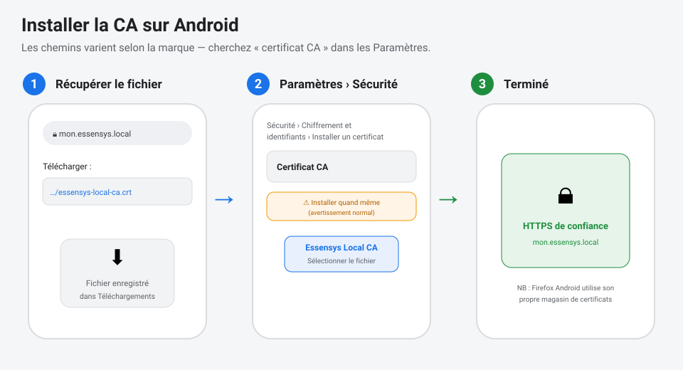

# Guide utilisateur — Accéder à `https://mon.essensys.local` en sécurité

Ce guide explique comment configurer **un appareil** (Mac, iPhone/iPad, PC Windows,
téléphone Android) pour accéder à l'interface Essensys locale en HTTPS **sans
avertissement de sécurité**.

> **Pourquoi cette étape ?** L'interface locale est servie en HTTPS par un
> certificat signé par l'autorité interne **« Essensys Local CA »**. Comme cette
> autorité n'est pas une autorité publique (impossible pour un domaine `.local`),
> chaque appareil doit l'installer **une seule fois**. Ensuite, le cadenas est vert
> et tout fonctionne normalement.

C'est une opération **sûre** : vous installez uniquement l'autorité de votre propre
passerelle Essensys, sur votre réseau local.

---

## En résumé (les 3 idées)

1. **Récupérer** le fichier d'autorité `essensys-local-ca.crt`.
2. **L'installer** comme autorité de **confiance** sur l'appareil.
3. **Ouvrir** `https://mon.essensys.local` → cadenas vert. ✅

### Où récupérer le fichier `essensys-local-ca.crt` ?

- **Téléchargement direct** (sur le réseau Essensys) :
  `https://mon.essensys.local/essensys-local-ca.crt`
  > Au tout premier accès, le navigateur affichera un avertissement : c'est normal,
  > vous téléchargez justement l'autorité qui le fera disparaître. Continuez.
- **Ou** demandez le fichier à votre administrateur (envoi par AirDrop / e-mail).

---

## 🍎 macOS



1. Récupérez `essensys-local-ca.crt` et **double-cliquez** dessus : il s'ouvre dans
   **Trousseau d'accès**, dans le trousseau **Système** (ou « Connexion »).
2. Double-cliquez sur **« Essensys Local CA »**, dépliez **« Se fier »**, et réglez
   **« Lors de l'utilisation de ce certificat »** sur **« Toujours approuver »**.
   Fermez la fenêtre (mot de passe Mac demandé).
3. Ouvrez `https://mon.essensys.local` — **redémarrez le navigateur** si besoin.
   La barre d'adresse indique alors **« Connexion sécurisée »**, sans avertissement.

> ✅ Vérifié en conditions réelles : après installation de la CA, `https://mon.essensys.local/dashboard`
> se charge dans le navigateur **sans aucune alerte de sécurité**.

> **Astuce admin** (en une commande, mot de passe demandé) :
> ```bash
> sudo security add-trusted-cert -d -r trustRoot \
>   -k /Library/Keychains/System.keychain essensys-local-ca.crt
> ```

---

## 📱 iPhone / iPad (iOS · iPadOS)



1. Dans **Safari**, ouvrez `https://mon.essensys.local/essensys-local-ca.crt` et
   acceptez le téléchargement du **profil**.
2. **Réglages › Général › VPN et gestion de l'appareil** → ouvrez le profil
   **« Essensys Local CA »** → **Installer** (code de l'appareil demandé).
3. ⚠️ **Étape indispensable** : **Réglages › Général › Infos › Réglages des
   certificats de confiance** → **activez** l'interrupteur en face de
   **« Essensys Local CA »**.
4. Ouvrez `https://mon.essensys.local`. ✅

---

## 🪟 Windows



1. **Double-cliquez** sur `essensys-local-ca.crt` → **Installer le certificat…**
2. Choisissez **« Ordinateur local »**, puis **« Placer tous les certificats dans
   le magasin suivant »** → **« Autorités de certification racines de confiance »**.
3. Terminez l'assistant, **redémarrez le navigateur**, puis ouvrez
   `https://mon.essensys.local`. ✅

> **Astuce admin** (PowerShell en administrateur) :
> ```powershell
> certutil -addstore -f Root essensys-local-ca.crt
> ```
> *Note : Firefox utilise son propre magasin — voir la section dédiée.*

---

## 🤖 Android



1. Téléchargez `essensys-local-ca.crt`.
2. **Paramètres › Sécurité › Chiffrement et identifiants › Installer un certificat
   › Certificat CA** (les libellés varient selon la marque — cherchez
   « certificat CA »). Validez l'avertissement.
3. Sélectionnez le fichier téléchargé. Ouvrez `https://mon.essensys.local`. ✅

---

## 🦊 Firefox (tous OS)

Firefox **n'utilise pas** le magasin du système : il faut l'importer dans Firefox.

1. **Paramètres › Vie privée et sécurité › Certificats › Afficher les certificats**
2. Onglet **« Autorités »** → **Importer…** → choisir `essensys-local-ca.crt`
3. Cocher **« Confirmer cette AC pour identifier des sites web »** → **OK**.

---

## ❓ Dépannage

| Symptôme | Cause / Solution |
|---|---|
| Toujours « non sécurisé » après install | Redémarrer **complètement** le navigateur (sur Chrome/Mac : Cmd+Q puis rouvrir). |
| `mon.essensys.local` introuvable | Être connecté au réseau Essensys ; la résolution se fait en mDNS/Bonjour sur le LAN. |
| Avertissement au téléchargement du `.crt` | Normal au 1ᵉʳ accès (HTTPS pas encore de confiance) — continuer. |
| Firefox affiche encore l'erreur | Firefox a son propre magasin → faire la section Firefox ci-dessus. |
| Cadenas OK sur `mon.essensys.fr` mais pas `.local` | `mon.essensys.fr` utilise un certificat public (rien à installer) ; `.local` nécessite la CA. |

---

*Public : utilisateurs finaux. Détails techniques (architecture, rôle Ansible,
rotation/révocation) : voir [tls-local-domain.md](tls-local-domain.md).*
