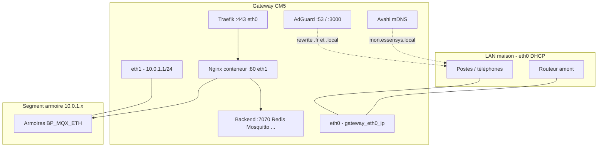

# Installation Gateway Essensys (CM5)

Guide d'installation **complète** du profil **Gateway** : Raspberry Pi **Compute Module 5**, double interface réseau (LAN + segment armoire), stockage **NVMe**, stack Essensys conteneurisée via Docker Compose.

Ce guide **complète** l'[installation Raspberry classique](playbooks.md#installation-raspberry-pi-classique) ; il ne la remplace pas.

---

## Vue d'ensemble

Le profil Gateway cible une **passerelle domotique CM5** montée sur la carte IO Essensys :

- **eth0** : réseau maison (DHCP client, HTTPS utilisateurs, mDNS, AdGuard DNS LAN).
- **eth1** : segment armoire isolé `10.0.1.0/24` (IP statique gateway, DHCP/DNS dnsmasq, HTTP legacy firmware).
- **NVMe** : données persistantes (`/opt/data`, logs) via bind mounts depuis `/mnt/nvme`.

Playbook principal : `install.gateway.yml`  
Inventaire dédié : `inventory.gateway`

### Comparaison profil classique vs Gateway

| Aspect | Classique (`install.raspberrypi.yml`) | Gateway (`install.gateway.yml`) |
|--------|--------------------------------------|----------------------------------|
| **Matériel** | Raspberry Pi (mono-NIC) | CM5 + carte IO dual Ethernet + NVMe |
| **Inventaire** | `inventory` | `inventory.gateway` |
| **Réseau** | Une interface, pas de rôle réseau dédié | `raspberry_gateway_network` (systemd-networkd eth0/eth1) |
| **Segment armoire** | Non | `raspberry_gateway_dhcp` (dnsmasq sur eth1) |
| **Stockage** | eMMC (`/opt/data` local) | `raspberry_gateway_nvme` (label `essensys-data`, bind mounts) |
| **mDNS LAN** | Non | `raspberry_avahi` → `mon.essensys.local` |
| **HTTP port 80** | Nginx sur toutes les interfaces | Nginx conteneur : **eth1 uniquement** ; eth0:80 → `444` |
| **HTTPS port 443** | Traefik (écoute globale) | Traefik lié à **`gateway_eth0_ip:443`** |
| **TLS `.local`** | Certificat auto-signé Traefik par défaut | CA locale Essensys (`raspberry_traefik`, tag `localtls`) — voir [tls-local-domain.md](tls-local-domain.md) |
| **TLS WAN (domaine public)** | Let's Encrypt (Traefik) | Idem + rewrites AdGuard split-horizon |
| **Rôles spécifiques** | — | NVMe, réseau, DHCP, Avahi (en tête de play) |
| **Pré-tâches play** | Non | Détection IP eth0, install Go 1.23.4 |
| **Cycle de vie CM5** | `uninstall.raspberrypi.yml` | `uninstall.cm5.yml`, `prepare.nixos-cm5.yml` |

---

## Architecture réseau



### Flux des ports (profil Gateway)

| Interface | Port | Service | Usage |
|-----------|------|---------|--------|
| **eth0** (`gateway_eth0_ip`) | 443 | Traefik (conteneur) | HTTPS LAN (`mon.essensys.local`) + WAN (`wan_domain`) |
| **eth0** | 80 | Nginx (conteneur) | **`return 444`** — HTTP LAN refusé volontairement |
| **eth0** | 53 | AdGuard Home | DNS filtrant LAN |
| **eth0** | 3000 | AdGuard Home | Interface web |
| **eth1** (`gateway_eth1_ip`) | 80 | Nginx (conteneur) | HTTP armoire (`mon.essensys.fr` via dnsmasq) |
| **eth1** | 53 | dnsmasq | DHCP + DNS split segment armoire |
| **host** | 7070 | Backend | API Go |
| **host** | 6379 | Redis | Persistance |
| **host** | 1883 | Mosquitto | MQTT |
| **host** | 8083 | MCP | Serveur MCP (SSE) |
| **host** | 9100 | Control Plane | Supervision |
| **host** | 9092 / 9093 / 9101 | Prometheus / Alertmanager / Node Exporter | Monitoring |
| **host** | 18789 | OpenClaw | Assistant IA |
| **host** | 9091 | Monitor MQTT Debug | Interface debug (systemd, hors compose) |

Liste détaillée et conflits connus : [ports-reference.md](ports-reference.md).

Choix Nginx vs Caddy (client legacy BP_MQX_ETH) : [nginx-vs-caddy.md](nginx-vs-caddy.md).

---

## Prérequis

### Matériel

- Raspberry Pi **Compute Module 5** sur carte IO Essensys (**2× Ethernet**, slot **NVMe M.2**).
- SSD NVMe présent sur `gateway_nvme_device` (défaut `/dev/nvme0n1`).
- eMMC ou support de boot avec **Debian/Raspberry Pi OS** accessible en SSH.
- Câblage :
  - **eth0** → switch/routeur LAN maison ;
  - **eth1** → switch segment armoire (armoires Essensys).

### Firmware / OS (sur la CM5, avant Ansible)

- **PCIe / NVMe** activé (EEPROM / `config.txt` selon votre image).
- Vérifier :
  ```bash
  lsblk                    # mmcblk0 (eMMC), nvme0n1 (SSD)
  ip link show eth0 eth1   # noter les MAC
  ```

### Poste contrôleur Ansible

- **Ansible** installé (`brew install ansible` sur macOS).
- Accès SSH vers l'utilisateur cible (`ansible_user`, défaut `essensys`).
- Clone du dépôt `essensys-ansible`.
- Dépendances collections : `ansible-galaxy install -r requirements.yml` si nécessaire.

---

## Préparation

### 1. Relever les adresses MAC

Sur la CM5 :

```bash
ip link show eth0 | awk '/ether/{print $2}'
ip link show eth1 | awk '/ether/{print $2}'
```

Ces valeurs alimentent **`gateway_eth0_mac`** et **`gateway_eth1_mac`** (obligatoires).

### 2. Configurer l'inventaire

Copier ou éditer `inventory.gateway` :

```ini
[raspberrypi]
gateway-essensys ansible_host=192.168.0.14 ansible_user=essensys

[raspberrypi:vars]
gateway_dual_nic=true
gateway_eth0_mac="88:a2:9e:34:27:61"
gateway_eth1_mac="00:e0:4c:68:01:be"
# ... voir tableau ci-dessous
```

Surcharge par machine : `host_vars/gateway-essensys.yml` (ex. réservations DHCP).

### 3. NVMe

Le rôle `raspberry_gateway_nvme` :

- partitionne `gateway_nvme_device` si nécessaire ;
- formate en **ext4** avec le label **`essensys-data`** ;
- monte sur **`essensys_nvme_mount`** (défaut `/mnt/nvme`) ;
- crée les bind mounts vers **`/opt/data`** et **`/var/log/essensys`** si `gateway_nvme_bind_mounts_enabled=true`.

---

## Variables d'inventaire (`inventory.gateway`)

| Variable | Obligatoire | Défaut (repo) | Description |
|----------|-------------|---------------|-------------|
| `ansible_host` | Oui (hôte) | `192.168.0.14` | IP SSH de la CM5 sur le LAN |
| `ansible_user` | Oui (hôte) | `essensys` | Utilisateur SSH / propriétaire des données |
| `gateway_dual_nic` | Oui | `true` | Active le profil double NIC |
| `gateway_eth0_mac` | **Oui** | *(exemple dans le repo)* | MAC eth0 (LAN) — matching systemd-networkd |
| `gateway_eth1_mac` | **Oui** | *(exemple dans le repo)* | MAC eth1 (armoire) |
| `gateway_eth0_ip` | Non | `""` | IP LAN pour binding HTTPS/AdGuard ; **auto-détectée** sur eth0 si vide (pre_task) |
| `gateway_eth1_ip` | Non | `10.0.1.1` | IP statique eth1 (segment armoire) |
| `gateway_eth1_prefix` | Non | `24` | Préfixe CIDR eth1 |
| `gateway_armoire_hostname` | Non | `mon.essensys.fr` | Nom DNS split-DNS dnsmasq → `gateway_eth1_ip` |
| `gateway_dhcp_range_start` | Non | `10.0.1.100` | Début plage DHCP armoire |
| `gateway_dhcp_range_end` | Non | `10.0.1.200` | Fin plage DHCP armoire |
| `gateway_dhcp_lease_time` | Non | `12h` | Durée des baux DHCP |
| `gateway_upstream_dns` | Non | `9.9.9.9` | DNS amont pour requêtes hors armoire (dnsmasq) |
| `gateway_dhcp_reservations` | Non | `[]` | Liste `{mac, ip, name}` — voir exemple commenté dans l'inventaire |
| `gateway_nvme_device` | Non | `/dev/nvme0n1` | Disque NVMe CM5 |
| `essensys_nvme_mount` | Non | `/mnt/nvme` | Point de montage NVMe |
| `gateway_nvme_bind_mounts_enabled` | Non | `true` | Bind mounts NVMe → `/opt/data`, `/var/log/essensys` |
| `wan_domain_default` | Non | `essensys.acme.com` | Domaine WAN si `/home/essensys/domain.txt` absent/vide |
| `acme_email` | Non | `admin@acme.com` | E-mail ACME Let's Encrypt |
| `use_staging` | Non | `false` | `true` → CA Let's Encrypt staging |

Exemple **`gateway_dhcp_reservations`** (dans `host_vars`) :

```yaml
gateway_dhcp_reservations:
  - mac: "aa:bb:cc:dd:ee:01"
    ip: "10.0.1.10"
    name: "armoire-principale"
```

### Variables du playbook (`install.gateway.yml`)

| Variable | Valeur dans le play | Rôle |
|----------|---------------------|------|
| `essensys_version` | `V.1.3.0` | Version images Docker front/back et Traefik |
| `control_plane_version` | `V.1.3.7` | Image Control Plane |
| `service_user` | `essensys` | Utilisateur système |
| `data_dir` | `/opt/data` | Données applicatives (souvent bind NVMe) |
| `config_dir` | `/opt/data/config` | Configurations services |
| `domain_file` | `/home/essensys/domain.txt` | Domaine WAN effectif (prioritaire sur `wan_domain_default`) |
| `go_version` | `1.23.4` | Go installé si absent (pre_task) |
| `traefik_version` | `v2.11.3` | Référence binaire Traefik |
| `install_dir` | `/opt/essensys` | Sources backend (rôle backend) |
| `backend_repo` / `frontend_repo` | GitHub essensys-hub | Dépôts clonés |
| `backend_version` / `frontend_version` | `{{ essensys_version }}` | Tags images |
| `unifi_enabled` | `false` | Intégration UniFi Protect |
| `unifi_base_url` | `https://192.168.0.1` | URL UniFi si activé |
| `unifi_api_key` | `""` | Clé API UniFi |

Le domaine WAN effectif **`wan_domain`** est calculé par `raspberry_common` à partir de `domain_file` ou `wan_domain_default`.

---

## Installation pas à pas

### 1. Vérifier la connectivité

```bash
cd essensys-ansible
ansible -i inventory.gateway raspberrypi -m ping
```

Réponse attendue : `pong`.

### 2. (Optionnel) Lister les tâches

```bash
ansible-playbook install.gateway.yml -i inventory.gateway --list-tasks
```

> Un `ansible-playbook --check` complet est **limité** (Docker, partitionnement NVMe) ; privilégier `--list-tasks` avant la première installation.

### 3. Lancer l'installation

```bash
ansible-playbook install.gateway.yml -i inventory.gateway
```

Relance TLS local uniquement :

```bash
ansible-playbook install.gateway.yml -i inventory.gateway --tags localtls
```

Voir [tls-local-domain.md](tls-local-domain.md) — éviter `--tags traefik` seul sans `wan_domain` défini.

### 4. Pré-tâches du play

1. **Détecte `gateway_eth0_ip`** via `ip -4 addr show eth0` si la variable est vide.
2. **Crée** `/opt/essensys`, `/opt/essensys/backend`, `/opt/essensys/frontend`.
3. **Installe** `python3-pip`, `python3-docker`, et **Go 1.23.4** dans `/usr/local/go` si absent.

### 5. Ordre des rôles

| # | Rôle | Fonction |
|---|------|----------|
| 1 | `raspberry_gateway_nvme` | Partition, fstab, bind mounts NVMe |
| 2 | `raspberry_gateway_network` | systemd-networkd eth0 (DHCP) / eth1 (statique) |
| 3 | `raspberry_gateway_dhcp` | dnsmasq DHCP + DNS split sur eth1 |
| 4 | `raspberry_common` | Paquets, utilisateur `essensys`, `/opt/data`, `wan_domain` |
| 5 | `raspberry_avahi` | mDNS `mon.essensys.local` → IP eth0 |
| 6 | `raspberry_docker` | Moteur Docker |
| 7 | `raspberry_mosquitto` | Config MQTT |
| 8 | `raspberry_redis` | Config Redis |
| 9 | `raspberry_backend` | Build / config backend |
| 10 | `raspberry_mcp` | Config MCP |
| 11 | `raspberry_frontend` | Pull image + extraction fichiers statiques |
| 12 | `raspberry_nginx` | Config conteneur Nginx (eth0:444, eth1:80) |
| 13 | `raspberry_traefik` | Traefik, routes WAN/LAN, CA locale `.local` |
| 14 | `raspberry_control_plane` | Config Control Plane |
| 15 | `raspberry_adguard` | AdGuard + rewrites DNS |
| 16 | `raspberry_prometheus` | Prometheus, Alertmanager, règles |
| 17 | `raspberry_openclaw` | OpenClaw |
| 18 | `raspberry_compose` | `docker compose pull` + `up -d` |
| 19 | `raspberry_monitor` | MQTT Debug (port 9091, systemd) |
| 20 | `raspberry_logrotate` | Rotation logs |
| 21 | `raspberry_push_status` | Timer push statut |

Conteneurs (`network_mode: host`) : `essensys-mosquitto`, `essensys-redis`, `essensys-backend`, `essensys-mcp`, `essensys-nginx`, `essensys-traefik`, `essensys-control-plane`, `essensys-adguard`, `essensys-prometheus`, `essensys-alertmanager`, `essensys-node-exporter`, `essensys-openclaw`.

Fichier compose : **`/opt/data/docker-compose.yml`**.

---

## DHCP / DNS segment armoire (eth1)

Service **dnsmasq** (`raspberry_gateway_dhcp`) :

- Écoute **eth1** / `gateway_eth1_ip` uniquement.
- Plage **`gateway_dhcp_range_start`–`gateway_dhcp_range_end`** (défaut `10.0.1.100`–`10.0.1.200`).
- Baux **`gateway_dhcp_lease_time`** (défaut `12h`).
- **Option 3** : pas de route par défaut (segment isolé).
- **Option 6** : DNS = `gateway_eth1_ip`.
- **Split-DNS** : `gateway_armoire_hostname` (défaut `mon.essensys.fr`) → `gateway_eth1_ip`.
- **Réservations** : `gateway_dhcp_reservations`.
- **Amont** : `gateway_upstream_dns` (défaut `9.9.9.9`).

---

## Résolution des noms

### mDNS (Avahi)

- Annonce **`mon.essensys.local`** (`avahi_hostname` + `avahi_domain`) → **`gateway_eth0_ip`**.
- Service : `avahi-publish-essensys.service`.

### AdGuard (split-horizon LAN)

Rewrites dans `AdGuardHome.yaml.j2` :

- **`mon.essensys.fr`** → IP LAN gateway ;
- **`mon.essensys.local`** → IP LAN gateway.

---

## HTTPS

| Nom | Mécanisme | Documentation |
|-----|-----------|---------------|
| **`mon.essensys.local`** | CA locale + certificat Traefik | [tls-local-domain.md](tls-local-domain.md), [guide-utilisateur-https-local.md](guide-utilisateur-https-local.md) |
| **`wan_domain`** | Let's Encrypt (`certResolver: letsencrypt`) | `use_staging`, `acme_email` dans l'inventaire |

**Ne pas recopier** la procédure CA ici. Résumé : **`.fr` (LAN via AdGuard)** = Let's Encrypt ; **`.local`** = CA Essensys Local (installation une fois par client).

---

## Vérification post-installation

### Services Docker

```bash
docker ps --format 'table {{.Names}}\t{{.Status}}'
```

Attendu : conteneurs `essensys-*` **Up**.

### Réseau et NVMe

```bash
ip -4 addr show eth0 eth1
findmnt /mnt/nvme /opt/data
systemctl is-active systemd-networkd dnsmasq avahi-daemon avahi-publish-essensys
```

Attendu : eth1 = `10.0.1.1/24` (si défaut inventaire) ; label NVMe **`essensys-data`**.

### API et HTTP

```bash
curl -s -o /dev/null -w '%{http_code}\n' http://127.0.0.1:7070/health
curl -s -o /dev/null -w '%{http_code}\n' http://10.0.1.1/
curl -sk -o /dev/null -w '%{http_code}\n' -H 'Host: mon.essensys.local' https://192.168.0.14/
```

Attendu : **`200`**, **`200`**, **`200`** (adapter l'IP LAN).

### HTTP eth0 (comportement attendu)

```bash
curl -s -o /dev/null -w '%{http_code}\n' --connect-timeout 2 http://192.168.0.14/
```

Attendu : **`000`** / connexion fermée — **eth0:80 = `444` par design**.

### mDNS et certificat

```bash
ping -c 1 mon.essensys.local
echo | openssl s_client -connect 192.168.0.14:443 -servername mon.essensys.local 2>/dev/null | openssl x509 -noout -subject -issuer
```

Attendu : ping vers IP LAN ; certificat pour **`mon.essensys.local`**, émetteur **Essensys Local CA** (après tag `localtls`).

---

## Mise à jour

Relancer le play gateway, éventuellement à partir d'une tâche :

```bash
ansible-playbook install.gateway.yml -i inventory.gateway \
  -e gateway_eth0_ip=192.168.0.14 \
  --start-at-task "Pull de l'image frontend"
```

**`update.raspberrypi.yml`** : inventaire **`inventory`**, version **`V.1.2.2`**, sans rôles NVMe/réseau gateway — **non adapté** tel quel à la CM5.

---

## Désinstallation et migration NixOS

```bash
ansible-playbook uninstall.cm5.yml -i inventory.gateway \
  -e confirm_cm5_uninstall=true

ansible-playbook prepare.nixos-cm5.yml -i inventory.gateway \
  -e confirm_cm5_nixos_prep=true
```

Détails : `roles/raspberry_cm5_uninstall/README.md`, `roles/raspberry_cm5_nixos/README.md`.

---

## Connectivité cloud (prérequis portail distant)

Avant d’activer le **portail utilisateur** sur `https://mon.essensys.fr`, la gateway doit joindre le VPS OVH en **HTTPS sortant (port 443)** via **eth0**. Le canal gateway ↔ cloud **ne doit pas** utiliser `http://mon.essensys.fr`.

### Checklist P0–P6

| # | Test | Commande | Attendu |
|---|------|----------|---------|
| P0 | DNS | `dig +short mon.essensys.fr` | IP publique OVH |
| P1 | TLS | `curl -sS -o /dev/null -w '%{http_code}\n' https://mon.essensys.fr/` | `200` ou `301` |
| P2 | Certificat | `curl -vI https://mon.essensys.fr/ 2>&1 \| grep -i subject` | SAN `mon.essensys.fr` |
| P3 | Pas HTTP WAN | `curl -sS -o /dev/null -w '%{http_code}\n' http://mon.essensys.fr/` | Redirect ou échec — l’agent cloud utilise **HTTPS uniquement** |
| P4 | API gateway | `curl -sS -o /dev/null -w '%{http_code}\n' -X POST https://mon.essensys.fr/api/gateway/heartbeat` | `401` sans token (route déployée) |
| P5 | Sortie eth0 | `ip route get $(dig +short mon.essensys.fr \| head -1)` | interface **eth0**, pas eth1 |
| P6 | Pare-feu box | HTTPS sortant autorisé | Documenter si blocage client |

### Script automatisé

Depuis le dépôt `essensys-raspberry-gateway` (sur la gateway ou via SSH) :

```bash
./scripts/test-wan-https-ovh.sh
# ou URL explicite :
./scripts/test-wan-https-ovh.sh https://mon.essensys.fr
```

Variables backend edge (`config.yaml`) lorsque le cloud sync est activé :

```yaml
cloud:
  enabled: true
  hub_url: "https://mon.essensys.fr"
  gateway_id: "gw-88a29e342761"   # ou vide → dérivé de eth0_mac
  gateway_token: "<vault_cloud_gateway_token>"
  poll_interval_seconds: 5
  client_id: "default"
  machine_id: 19
  eth0_mac: "88:a2:9e:34:27:61"   # CM5 WAN (eth0)
  eth1_mac: "00:e0:4c:68:01:be"   # bus armoire (eth1)
```

Enregistrement admin (triplet obligatoire) :

```bash
curl -X POST https://mon.essensys.fr/api/portal/admin/gateways/register \
  -H "Authorization: Bearer $ADMIN_JWT" \
  -H "Content-Type: application/json" \
  -d '{
    "gateway_id": "gw-88a29e342761",
    "token": "vault-token",
    "machine_id": 19,
    "eth0_mac": "88:a2:9e:34:27:61",
    "eth1_mac": "00:e0:4c:68:01:be"
  }'
```

Variables Ansible gateway : `cloud_gateway_id`, `cloud_gateway_token`, `cloud_gateway_machine_id`, `cloud_gateway_eth0_mac`, `cloud_gateway_eth1_mac` (vault).

Poll gateway : headers `X-Gateway-ID`, `X-Gateway-Eth0-MAC`, `X-Gateway-Eth1-MAC` + Bearer token. Filtrage strict `cloud_actions.machine_id = gateway_sessions.machine_id`.

---

## Dépannage

| Symptôme | Cause probable | Action |
|----------|----------------|--------|
| Échec MAC obligatoires | MAC vides dans l'inventaire | Relever `ip link`, mettre à jour `inventory.gateway` |
| NVMe introuvable | PCIe off ou mauvais device | `lsblk`, `gateway_nvme_device` |
| eth1 sans IP | MAC incorrecte | `networkctl status`, `20-eth1.network` |
| Armoires hors service | DHCP/DNS eth1 | `journalctl -u dnsmasq` |
| HTTP sur IP LAN ne répond pas | **Normal** — eth0:80 = 444 | HTTPS `mon.essensys.local` ou HTTP `10.0.1.1` |
| Alert certificat `.local` | CA non installée | [guide-utilisateur-https-local.md](guide-utilisateur-https-local.md) |
| Routes WAN Traefik en erreur | Play partiel sans `wan_domain` | Relancer depuis `raspberry_common` |
| Conflit port 53 eth1 | Autre DNS sur eth1 | `ss -tlnup sport = :53` |
| Conteneurs down | Compose ou NVMe | `docker compose -f /opt/data/docker-compose.yml ps` |

---

## Voir aussi

- [Playbooks](playbooks.md)
- [Rôles](roles.md)
- [tls-local-domain.md](tls-local-domain.md)
- [guide-utilisateur-https-local.md](guide-utilisateur-https-local.md)
- [ports-reference.md](ports-reference.md)
- [nginx-vs-caddy.md](nginx-vs-caddy.md)
